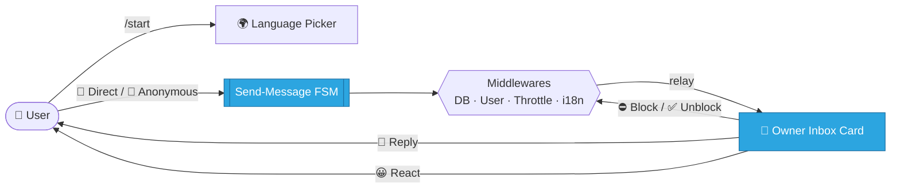

<div align="center">

# 🌉 Telegram Message Bridge

### A modern, modular Telegram bot that bridges your audience to you — **directly** or **anonymously**.

<br/>

[](https://www.python.org/)
[](https://docs.aiogram.dev/)
[](https://www.sqlalchemy.org/)
[](LICENSE)


<br/>

**🌍 Read this in other languages**

**English** ·
[العربية](docs/README.ar.md) ·
[Español](docs/README.es.md) ·
[Русский](docs/README.ru.md) ·
[中文](docs/README.zh.md)

</div>

---

> [!WARNING]
> **🚧 This project is actively under development and testing.**
> Core flows are implemented and usable, but APIs, structure, and UX may change before a stable `v1.0` release. Use it for experimentation and feedback.

---

## 📖 Table of Contents

- [✨ Overview](#-overview)
- [🎯 Features](#-features)
- [🌍 Internationalization](#-internationalization)
- [🧭 How It Works](#-how-it-works)
- [🧱 Tech Stack](#-tech-stack)
- [🗂️ Project Structure](#️-project-structure)
- [🚀 Getting Started](#-getting-started)
- [⚙️ Configuration](#️-configuration)
- [🧠 Design Notes](#-design-notes)
- [🗺️ Roadmap](#️-roadmap)
- [🤝 Contributing](#-contributing)
- [📄 License](#-license)

---

## ✨ Overview

**Telegram Message Bridge** is a personal communication gateway. It lets anyone reach the bot owner through a clean, guided flow, while giving the owner full control over the conversation.

Users choose between two modes:

| Mode | Sender identity | Use case |
| :--- | :--- | :--- |
| 💌 **Direct** | Visible to the owner (name, username, ID) | Friends, contacts, accountable messages |
| 🥷 **Anonymous** | Fully hidden from the owner | Honest feedback, private questions |

The owner receives every message in a rich **inbox card** with one-tap actions: reply, block/unblock, and emoji reactions.

---

## 🎯 Features

- 📨 **User → Owner relay** for text **and all media types** (photo, video, voice, documents, …)
- 🎭 **Two delivery modes** — direct & anonymous — powered by FSM flows
- 🗃️ **Owner inbox actions** — reply, block / unblock, emoji reactions
- 🛡️ **Global block enforcement** — blocked users are dropped at the middleware layer
- 🚦 **Anti-spam throttling** — TTL-based rate limiting with temporary blocking
- 🌍 **Full i18n** — 21 languages via Fluent, with the user's locale **persisted in DB**
- 🟢 **Inline language picker** — the active language is highlighted as a green button
- 🔗 **Config-driven social links** — managed from a validated JSON file
- 🧾 **Structured logging** — clean, rich, production-friendly logs
- ⚡ **Fully async** — `aiogram 3` + async SQLAlchemy + aiosqlite

---

## 🌍 Internationalization

The bot ships with **21 fully translated locales**:

<div align="center">

🇬🇧 English · 🇷🇺 Русский · 🇺🇦 Українська · 🇪🇸 Español · 🇺🇿 Oʻzbek · 🇧🇷 Português · 🇩🇪 Deutsch
🇮🇹 Italiano · 🇫🇷 Français · 🇹🇷 Türkçe · 🇮🇱 עברית · 🇸🇦 العربية · 🇮🇷 فارسی · 🇨🇳 中文
🇮🇩 Bahasa Indonesia · 🇸🇪 Svenska · 🇲🇾 Bahasa Melayu · 🇳🇱 Nederlands · 🇮🇳 हिन्दी · 🇰🇷 한국어 · 🇻🇳 Tiếng Việt

</div>

Locale resolution is automatic (from Telegram), overridable via the inline picker, and stored per-user in `members.preferred_lang`. RTL languages (Persian, Arabic, Hebrew) are fully supported.

---

## 🧭 How It Works



1. The user opens the bot and (optionally) picks a language.
2. They choose **Direct** or **Anonymous** and send a single message of any type.
3. Middlewares hydrate the user, enforce blocks, and throttle spam.
4. The owner gets an **inbox card** and can reply, block/unblock, or react.
5. Replies are delivered back to the user in **their own language**.

---

## 🧱 Tech Stack

| Layer | Technology |
| :--- | :--- |
| **Bot framework** | [`aiogram 3.25`](https://docs.aiogram.dev/) |
| **Internationalization** | [`aiogram-i18n`](https://github.com/aiogram/i18n) + Fluent Runtime |
| **Database / ORM** | [SQLAlchemy 2.x](https://www.sqlalchemy.org/) (async) + `aiosqlite` |
| **Configuration** | [Pydantic Settings](https://docs.pydantic.dev/latest/concepts/pydantic_settings/) |
| **Logging** | [`structlog`](https://www.structlog.org/) + [`rich`](https://github.com/Textualize/rich) |
| **Caching / throttling** | [`cachebox`](https://github.com/awolverp/cachebox) (TTL cache) |
| **Dependency management** | [Poetry](https://python-poetry.org/) |

---

## 🗂️ Project Structure

```text
telegram-msg-bridge/
├── config/                 # Pydantic settings + social-links loader
├── core/                   # Bot/Dispatcher factories, setup & polling runner
├── database/               # Connector, UoW scope, ORM models, stores
├── enums/                  # Locale, actions, effects, modes, reactions
├── filter/                 # Custom aiogram filters (e.g. sudo access)
├── handler/
│   ├── user/               # command · button · state · callback · helper
│   └── sudo/               # command · state · callback · helper
├── keyboard/
│   ├── user/               # inline/reply keyboards + callback factories
│   └── sudo/               # owner keyboards + callback factories
├── lexicon/                # Fluent translation bundles (21 locales)
├── middleware/             # DB scope · user hydration · i18n · throttling
├── state/                  # FSM state groups (user / sudo)
├── util/                   # Logging setup + bot command registration
├── .env.example
├── main.py                 # Application entry point
└── pyproject.toml          # Poetry project & dependencies
```

---

## 🚀 Getting Started

### Prerequisites

- **Python** `>=3.12,<3.15`
- **[Poetry](https://python-poetry.org/)** for dependency management
- A **Telegram Bot Token** from [@BotFather](https://t.me/botfather)
- Your **Telegram user ID** from [@userinfobot](https://t.me/userinfobot)

### Installation

```bash
# 1. Clone the repository
git clone https://github.com/Melfex/telegram-msg-bridge.git
cd telegram-msg-bridge

# 2. Install dependencies
poetry install

# 3. Configure environment & social links (see below)
cp .env.example .env
cp config/social_links.example.json config/social_links.json

# 4. Run the bot
poetry run python main.py
```

On startup the app initializes logging, creates database tables, registers bot commands, and starts long-polling.

---

## ⚙️ Configuration

### Environment variables (`.env`)

| Variable | Required | Description |
| :--- | :---: | :--- |
| `BOT_TOKEN` | ✅ | Bot API token from [@BotFather](https://t.me/botfather) |
| `SUDO_ID` | ✅ | Telegram user ID of the owner (sudo) |
| `DATABASE_URL` | ✅ | Async DB URL (default: `sqlite+aiosqlite:///database.db`) |

```env
BOT_TOKEN=123456:ABC-DEF...
SUDO_ID=987654321
DATABASE_URL=sqlite+aiosqlite:///database.db
```

### Social links (`config/social_links.json`)

```json
{
  "links": [
    { "label": "GitHub",    "url": "https://github.com/your-handle" },
    { "label": "Instagram", "url": "https://instagram.com/your-handle" }
  ]
}
```

> [!NOTE]
> `config/social_links.json` is **gitignored** on purpose — copy it from `config/social_links.example.json` and fill in your own links.

---

## 🧠 Design Notes

- **Stateless routing for owner actions** — reply/block/react carry their context in compact callback payloads instead of per-message database rows, keeping the DB lean.
- **Locale-aware delivery** — owner replies are rendered in the *recipient's* language, not the owner's.
- **Privacy by design** — anonymous messages never persist sender identity.
- **Single DB connector** — injected once and shared across middlewares.

---

## 🗺️ Roadmap

- [x] Direct & anonymous messaging flows
- [x] Owner inbox actions (reply / block / react)
- [x] 21-language i18n + inline language picker
- [x] Config-driven social links
- [ ] Expanded automated test coverage
- [ ] Deployment guides (Docker / systemd)
- [ ] Optional PostgreSQL production profile
- [ ] CI pipeline & quality gates

---

## 🤝 Contributing

Contributions are very welcome! 💛

1. **Fork** the repository
2. Create a feature branch — `git checkout -b feat/amazing-feature`
3. **Commit** your changes — `git commit -m "feat: add amazing feature"`
4. **Push** the branch — `git push origin feat/amazing-feature`
5. Open a **Pull Request**

For significant changes, please open an issue first to discuss the direction.

---

## 📄 License

Distributed under the **MIT License**. See [`LICENSE`](LICENSE) for details.

---

<div align="center">

Built with ❤️ using [aiogram 3](https://docs.aiogram.dev/) and modern, async Python.

**If you find this project useful, consider giving it a ⭐!**

Maintained by [@Melfex](https://t.me/Melfex)

</div>
