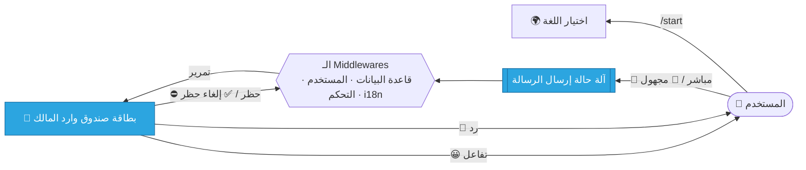

<div align="center">

# 🌉 جسر رسائل تليجرام

### بوت تليجرام عصري ومعياري يربط جمهورك بك — بشكل **مباشر** أو **مجهول**.

<br/>

[](https://www.python.org/)
[](https://docs.aiogram.dev/)
[](https://www.sqlalchemy.org/)
[](../../LICENSE)


<br/>

**🌍 اقرأ هذا بلغات أخرى**

[English](../README.md) ·
**العربية** ·
[Español](README.es.md) ·
[Русский](README.ru.md) ·
[中文](README.zh.md)

</div>

---

> [!WARNING]
> **🚧 هذا المشروع قيد التطوير والاختبار النشط.**
> المسارات الأساسية مُنفَّذة وقابلة للاستخدام، لكن البنية والواجهات وتجربة المستخدم قد تتغير قبل إصدار النسخة المستقرة `v1.0`. استخدمه للتجربة وتقديم الملاحظات.

---

<div dir="rtl">

## 📖 جدول المحتويات

- [✨ نظرة عامة](#-نظرة-عامة)
- [🎯 المزايا](#-المزايا)
- [🌍 تعدد اللغات](#-تعدد-اللغات)
- [🧭 كيف يعمل](#-كيف-يعمل)
- [🧱 التقنيات المستخدمة](#-التقنيات-المستخدمة)
- [🗂️ هيكل المشروع](#️-هيكل-المشروع)
- [🚀 البدء](#-البدء)
- [⚙️ الإعداد](#️-الإعداد)
- [🧠 ملاحظات التصميم](#-ملاحظات-التصميم)
- [🗺️ خريطة الطريق](#️-خريطة-الطريق)
- [🤝 المساهمة](#-المساهمة)
- [📄 الرخصة](#-الرخصة)

---

## ✨ نظرة عامة

**جسر رسائل تليجرام** هو بوابة تواصل شخصية. يتيح لأي شخص الوصول إلى مالك البوت عبر مسار نظيف وموجَّه، مع منح المالك تحكمًا كاملًا في المحادثة.

يختار المستخدمون بين وضعين:

| الوضع | هوية المُرسِل | حالة الاستخدام |
| :--- | :--- | :--- |
| 💌 **مباشر** | مرئية للمالك (الاسم، المعرّف، الـ ID) | الأصدقاء، جهات الاتصال، الرسائل الموثوقة |
| 🥷 **مجهول** | مخفية تمامًا عن المالك | ملاحظات صادقة، أسئلة خاصة |

يتلقى المالك كل رسالة في **بطاقة صندوق وارد** غنية مع إجراءات بلمسة واحدة: الرد، الحظر/إلغاء الحظر، والتفاعل بالإيموجي.

---

## 🎯 المزايا

- 📨 **تمرير رسائل المستخدم إلى المالك** للنص **وجميع أنواع الوسائط** (صورة، فيديو، صوت، مستندات…)
- 🎭 **وضعان للإرسال** — مباشر ومجهول — مدعومان بآلة الحالة (FSM)
- 🗃️ **إجراءات صندوق وارد المالك** — رد، حظر/إلغاء حظر، تفاعل بالإيموجي
- 🛡️ **فرض الحظر عالميًا** — يُسقَط المستخدمون المحظورون في طبقة الـ middleware
- 🚦 **مكافحة الإغراق** — تحديد المعدل المبني على TTL مع حظر مؤقت
- 🌍 **تعدد لغات كامل** — 21 لغة عبر Fluent مع **حفظ لغة المستخدم في قاعدة البيانات**
- 🟢 **قائمة اختيار اللغة المضمَّنة** — تُبرَز اللغة النشطة كزر أخضر
- 🔗 **روابط اجتماعية معتمدة على الإعداد** — تُدار من ملف JSON مُتحقَّق منه
- 🧾 **تسجيل منظَّم** — سجلات نظيفة واحترافية
- ⚡ **غير متزامن بالكامل** — `aiogram 3` + SQLAlchemy غير متزامن + aiosqlite

---

## 🌍 تعدد اللغات

يأتي البوت مع **21 لغة مترجمة بالكامل**:

<div align="center">

🇬🇧 English · 🇷🇺 Русский · 🇺🇦 Українська · 🇪🇸 Español · 🇺🇿 Oʻzbek · 🇧🇷 Português · 🇩🇪 Deutsch
🇮🇹 Italiano · 🇫🇷 Français · 🇹🇷 Türkçe · 🇮🇱 עברית · 🇸🇦 العربية · 🇮🇷 فارسی · 🇨🇳 中文
🇮🇩 Bahasa Indonesia · 🇸🇪 Svenska · 🇲🇾 Bahasa Melayu · 🇳🇱 Nederlands · 🇮🇳 हिन्दी · 🇰🇷 한국어 · 🇻🇳 Tiếng Việt

</div>

يتم تحديد اللغة تلقائيًا (من تليجرام)، وقابل للتغيير عبر القائمة المضمَّنة، ويُحفَظ لكل مستخدم في `members.preferred_lang`. اللغات من اليمين إلى اليسار (الفارسية، العربية، العبرية) مدعومة بالكامل.

</div>

---

## 🧭 كيف يعمل



<div dir="rtl">

1. يفتح المستخدم البوت ويختار اللغة (اختياريًا).
2. يختار وضع **مباشر** أو **مجهول** ويرسل رسالة واحدة من أي نوع.
3. تُجهِّز الـ middlewares المستخدم، وتفرض الحظر، وتحدّ من الإغراق.
4. يتلقى المالك **بطاقة صندوق وارد** ويمكنه الرد أو الحظر/إلغاء الحظر أو التفاعل.
5. تُسلَّم الردود إلى المستخدم **بلغته الخاصة**.

</div>

---

<div dir="rtl">

## 🧱 التقنيات المستخدمة

| الطبقة | التقنية |
| :--- | :--- |
| **إطار البوت** | [`aiogram 3.25`](https://docs.aiogram.dev/) |
| **تعدد اللغات** | [`aiogram-i18n`](https://github.com/aiogram/i18n) + Fluent Runtime |
| **قاعدة البيانات / ORM** | [SQLAlchemy 2.x](https://www.sqlalchemy.org/) (غير متزامن) + `aiosqlite` |
| **الإعداد** | [Pydantic Settings](https://docs.pydantic.dev/latest/concepts/pydantic_settings/) |
| **التسجيل** | [`structlog`](https://www.structlog.org/) + [`rich`](https://github.com/Textualize/rich) |
| **التخزين المؤقت / التحكم بالمعدل** | [`cachebox`](https://github.com/awolverp/cachebox) (TTL cache) |
| **إدارة الاعتماديات** | [Poetry](https://python-poetry.org/) |

</div>

---

## 🗂️ هيكل المشروع

```text
telegram-msg-bridge/
├── config/                 # إعدادات Pydantic + مُحمِّل الروابط الاجتماعية
├── core/                   # مصانع Bot/Dispatcher، الإعداد ومشغّل polling
├── database/               # الموصِّل، نطاق UoW، نماذج ORM، المخازن
├── enums/                  # اللغة، الإجراءات، التأثيرات، الأوضاع، التفاعلات
├── filter/                 # فلاتر aiogram المخصصة (مثل صلاحية sudo)
├── handler/
│   ├── user/               # command · button · state · callback · helper
│   └── sudo/               # command · state · callback · helper
├── keyboard/
│   ├── user/               # لوحات المستخدم المضمَّنة/الرد + الـ callbacks
│   └── sudo/               # لوحات المالك + الـ callbacks
├── lexicon/                # حزم ترجمة Fluent (21 لغة)
├── middleware/             # نطاق قاعدة البيانات · تجهيز المستخدم · i18n · التحكم بالمعدل
├── state/                  # مجموعات حالة FSM (المستخدم / المالك)
├── util/                   # إعداد التسجيل + تسجيل أوامر البوت
├── .env.example
├── main.py                 # نقطة دخول التطبيق
└── pyproject.toml          # مشروع واعتماديات Poetry
```

---

<div dir="rtl">

## 🚀 البدء

### المتطلبات

- **Python** `>=3.12,<3.15`
- **[Poetry](https://python-poetry.org/)** لإدارة الاعتماديات
- **رمز بوت تليجرام** من [@BotFather](https://t.me/botfather)
- **معرّف تليجرام الرقمي** الخاص بك من [@userinfobot](https://t.me/userinfobot)

</div>

### التثبيت

```bash
# 1. استنساخ المستودع
git clone https://github.com/Melfex/telegram-msg-bridge.git
cd telegram-msg-bridge

# 2. تثبيت الاعتماديات
poetry install

# 3. إعداد البيئة والروابط الاجتماعية (انظر أدناه)
cp .env.example .env
cp config/social_links.example.json config/social_links.json

# 4. تشغيل البوت
poetry run python main.py
```

<div dir="rtl">

عند بدء التشغيل، يُهيّئ التطبيق التسجيل، وينشئ جداول قاعدة البيانات، ويسجّل أوامر البوت، ويبدأ وضع long-polling.

</div>

---

## ⚙️ الإعداد

### متغيرات البيئة (`.env`)

| المتغير | إلزامي | الوصف |
| :--- | :---: | :--- |
| `BOT_TOKEN` | ✅ | رمز البوت من [@BotFather](https://t.me/botfather) |
| `SUDO_ID` | ✅ | معرّف تليجرام الرقمي للمالك (sudo) |
| `DATABASE_URL` | ✅ | رابط قاعدة بيانات غير متزامن (الافتراضي: `sqlite+aiosqlite:///database.db`) |

```env
BOT_TOKEN=123456:ABC-DEF...
SUDO_ID=987654321
DATABASE_URL=sqlite+aiosqlite:///database.db
```

### الروابط الاجتماعية (`config/social_links.json`)

```json
{
  "links": [
    { "label": "GitHub",    "url": "https://github.com/your-handle" },
    { "label": "Instagram", "url": "https://instagram.com/your-handle" }
  ]
}
```

> [!NOTE]
> الملف `config/social_links.json` مُستثنى عمدًا في `.gitignore` — انسخه من `config/social_links.example.json` واملأ روابطك الخاصة.

---

<div dir="rtl">

## 🧠 ملاحظات التصميم

- **توجيه بلا حالة لإجراءات المالك** — الرد/الحظر/التفاعل تحمل سياقها في حمولات callback مدمجة بدلًا من صفوف قاعدة بيانات لكل رسالة، مما يبقي قاعدة البيانات خفيفة.
- **تسليم مراعٍ للغة** — تُعرض ردود المالك بلغة *المستلِم* وليس لغة المالك.
- **الخصوصية بالتصميم** — لا تحفظ الرسائل المجهولة هوية المُرسِل أبدًا.
- **موصِّل قاعدة بيانات واحد** — يُحقَن مرة واحدة ويُشارَك بين الـ middlewares.

## 🗺️ خريطة الطريق

- [x] مساري الرسائل المباشر والمجهول
- [x] إجراءات صندوق وارد المالك (رد / حظر / تفاعل)
- [x] تعدد لغات 21 لغة + قائمة اختيار اللغة المضمَّنة
- [x] روابط اجتماعية معتمدة على الإعداد
- [ ] توسيع تغطية الاختبارات الآلية
- [ ] أدلة النشر (Docker / systemd)
- [ ] ملف PostgreSQL اختياري للإنتاج
- [ ] خط أنابيب CI وبوابات الجودة

## 🤝 المساهمة

المساهمات مرحَّب بها جدًا! 💛

1. اعمل **Fork** للمستودع
2. أنشئ فرع ميزة — `git checkout -b feat/amazing-feature`
3. نفّذ **commit** لتغييراتك — `git commit -m "feat: add amazing feature"`
4. ادفع الفرع — `git push origin feat/amazing-feature`
5. افتح **Pull Request**

للتغييرات الكبيرة، يُرجى فتح issue أولًا لمناقشة الاتجاه.

## 📄 الرخصة

موزَّع تحت **رخصة MIT**. انظر [`LICENSE`](../../LICENSE) للتفاصيل.

</div>

---

<div align="center">

بُني بـ ❤️ باستخدام [aiogram 3](https://docs.aiogram.dev/) وبايثون عصري غير متزامن.

**إذا وجدت هذا المشروع مفيدًا، فكّر في منحه ⭐!**

تتم صيانته بواسطة [@Melfex](https://t.me/Melfex)

</div>
