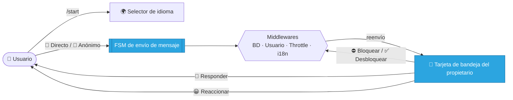

<div align="center">

# 🌉 Telegram Message Bridge

### Un bot de Telegram moderno y modular que conecta a tu audiencia contigo — de forma **directa** o **anónima**.

<br/>

[](https://www.python.org/)
[](https://docs.aiogram.dev/)
[](https://www.sqlalchemy.org/)
[](../../LICENSE)


<br/>

**🌍 Lee esto en otros idiomas**

[English](../README.md) ·
[العربية](README.ar.md) ·
**Español** ·
[Русский](README.ru.md) ·
[中文](README.zh.md)

</div>

---

> [!WARNING]
> **🚧 Este proyecto está en desarrollo y pruebas activas.**
> Los flujos principales están implementados y son utilizables, pero la estructura, las API y la experiencia de usuario pueden cambiar antes de una versión estable `v1.0`. Úsalo para experimentar y dar feedback.

---

## 📖 Tabla de Contenidos

- [✨ Descripción](#-descripción)
- [🎯 Características](#-características)
- [🌍 Internacionalización](#-internacionalización)
- [🧭 Cómo Funciona](#-cómo-funciona)
- [🧱 Tecnologías](#-tecnologías)
- [🗂️ Estructura del Proyecto](#️-estructura-del-proyecto)
- [🚀 Primeros Pasos](#-primeros-pasos)
- [⚙️ Configuración](#️-configuración)
- [🧠 Notas de Diseño](#-notas-de-diseño)
- [🗺️ Hoja de Ruta](#️-hoja-de-ruta)
- [🤝 Contribuir](#-contribuir)
- [📄 Licencia](#-licencia)

---

## ✨ Descripción

**Telegram Message Bridge** es una pasarela de comunicación personal. Permite que cualquiera contacte al propietario del bot a través de un flujo limpio y guiado, dándole al propietario control total sobre la conversación.

Los usuarios eligen entre dos modos:

| Modo | Identidad del remitente | Caso de uso |
| :--- | :--- | :--- |
| 💌 **Directo** | Visible para el propietario (nombre, usuario, ID) | Amigos, contactos, mensajes con responsabilidad |
| 🥷 **Anónimo** | Totalmente oculta al propietario | Feedback honesto, preguntas privadas |

El propietario recibe cada mensaje en una rica **tarjeta de bandeja de entrada** con acciones de un toque: responder, bloquear/desbloquear y reaccionar con emoji.

---

## 🎯 Características

- 📨 **Reenvío usuario → propietario** para texto **y todo tipo de multimedia** (foto, vídeo, voz, documentos…)
- 🎭 **Dos modos de envío** — directo y anónimo — impulsados por flujos FSM
- 🗃️ **Acciones de bandeja del propietario** — responder, bloquear/desbloquear, reacciones emoji
- 🛡️ **Bloqueo global** — los usuarios bloqueados se descartan en la capa de middleware
- 🚦 **Anti-spam** — limitación de tasa basada en TTL con bloqueo temporal
- 🌍 **i18n completo** — 21 idiomas vía Fluent, con el idioma del usuario **guardado en BD**
- 🟢 **Selector de idioma en línea** — el idioma activo se resalta como botón verde
- 🔗 **Enlaces sociales por configuración** — gestionados desde un JSON validado
- 🧾 **Registro estructurado** — logs limpios y profesionales
- ⚡ **Totalmente asíncrono** — `aiogram 3` + SQLAlchemy async + aiosqlite

---

## 🌍 Internacionalización

El bot incluye **21 idiomas totalmente traducidos**:

<div align="center">

🇬🇧 English · 🇷🇺 Русский · 🇺🇦 Українська · 🇪🇸 Español · 🇺🇿 Oʻzbek · 🇧🇷 Português · 🇩🇪 Deutsch
🇮🇹 Italiano · 🇫🇷 Français · 🇹🇷 Türkçe · 🇮🇱 עברית · 🇸🇦 العربية · 🇮🇷 فارسی · 🇨🇳 中文
🇮🇩 Bahasa Indonesia · 🇸🇪 Svenska · 🇲🇾 Bahasa Melayu · 🇳🇱 Nederlands · 🇮🇳 हिन्दी · 🇰🇷 한국어 · 🇻🇳 Tiếng Việt

</div>

La resolución del idioma es automática (desde Telegram), modificable con el selector en línea y se almacena por usuario en `members.preferred_lang`. Los idiomas RTL (persa, árabe, hebreo) son totalmente compatibles.

---

## 🧭 Cómo Funciona



1. El usuario abre el bot y (opcionalmente) elige un idioma.
2. Elige el modo **Directo** o **Anónimo** y envía un único mensaje de cualquier tipo.
3. Los middlewares preparan al usuario, aplican bloqueos y limitan el spam.
4. El propietario recibe una **tarjeta de bandeja** y puede responder, bloquear/desbloquear o reaccionar.
5. Las respuestas se entregan al usuario **en su propio idioma**.

---

## 🧱 Tecnologías

| Capa | Tecnología |
| :--- | :--- |
| **Framework del bot** | [`aiogram 3.25`](https://docs.aiogram.dev/) |
| **Internacionalización** | [`aiogram-i18n`](https://github.com/aiogram/i18n) + Fluent Runtime |
| **Base de datos / ORM** | [SQLAlchemy 2.x](https://www.sqlalchemy.org/) (async) + `aiosqlite` |
| **Configuración** | [Pydantic Settings](https://docs.pydantic.dev/latest/concepts/pydantic_settings/) |
| **Registro** | [`structlog`](https://www.structlog.org/) + [`rich`](https://github.com/Textualize/rich) |
| **Caché / throttling** | [`cachebox`](https://github.com/awolverp/cachebox) (caché TTL) |
| **Gestor de dependencias** | [Poetry](https://python-poetry.org/) |

---

## 🗂️ Estructura del Proyecto

```text
telegram-msg-bridge/
├── config/                 # Ajustes Pydantic + cargador de enlaces sociales
├── core/                   # Fábricas Bot/Dispatcher, configuración y runner de polling
├── database/               # Conector, scope UoW, modelos ORM, stores
├── enums/                  # Idioma, acciones, efectos, modos, reacciones
├── filter/                 # Filtros personalizados de aiogram (p. ej. acceso sudo)
├── handler/
│   ├── user/               # command · button · state · callback · helper
│   └── sudo/               # command · state · callback · helper
├── keyboard/
│   ├── user/               # teclados inline/reply + fábricas de callback
│   └── sudo/               # teclados del propietario + fábricas de callback
├── lexicon/                # Paquetes de traducción Fluent (21 idiomas)
├── middleware/             # scope de BD · hidratación de usuario · i18n · throttling
├── state/                  # Grupos de estado FSM (usuario / sudo)
├── util/                   # Configuración de logging + registro de comandos
├── .env.example
├── main.py                 # Punto de entrada de la aplicación
└── pyproject.toml          # Proyecto y dependencias de Poetry
```

---

## 🚀 Primeros Pasos

### Requisitos previos

- **Python** `>=3.12,<3.15`
- **[Poetry](https://python-poetry.org/)** para la gestión de dependencias
- Un **token de bot de Telegram** de [@BotFather](https://t.me/botfather)
- Tu **ID de usuario de Telegram** de [@userinfobot](https://t.me/userinfobot)

### Instalación

```bash
# 1. Clona el repositorio
git clone https://github.com/Melfex/telegram-msg-bridge.git
cd telegram-msg-bridge

# 2. Instala las dependencias
poetry install

# 3. Configura el entorno y los enlaces sociales (ver abajo)
cp .env.example .env
cp config/social_links.example.json config/social_links.json

# 4. Ejecuta el bot
poetry run python main.py
```

Al iniciar, la aplicación inicializa el logging, crea las tablas de la base de datos, registra los comandos del bot e inicia el long-polling.

---

## ⚙️ Configuración

### Variables de entorno (`.env`)

| Variable | Requerida | Descripción |
| :--- | :---: | :--- |
| `BOT_TOKEN` | ✅ | Token del bot de [@BotFather](https://t.me/botfather) |
| `SUDO_ID` | ✅ | ID de usuario de Telegram del propietario (sudo) |
| `DATABASE_URL` | ✅ | URL de BD async (por defecto: `sqlite+aiosqlite:///database.db`) |

```env
BOT_TOKEN=123456:ABC-DEF...
SUDO_ID=987654321
DATABASE_URL=sqlite+aiosqlite:///database.db
```

### Enlaces sociales (`config/social_links.json`)

```json
{
  "links": [
    { "label": "GitHub",    "url": "https://github.com/your-handle" },
    { "label": "Instagram", "url": "https://instagram.com/your-handle" }
  ]
}
```

> [!NOTE]
> `config/social_links.json` está **excluido de git** a propósito — cópialo desde `config/social_links.example.json` y rellena tus propios enlaces.

---

## 🧠 Notas de Diseño

- **Enrutamiento sin estado para acciones del propietario** — responder/bloquear/reaccionar llevan su contexto en payloads de callback compactos en lugar de filas de BD por mensaje, manteniendo la BD ligera.
- **Entrega según el idioma** — las respuestas del propietario se renderizan en el idioma del *destinatario*, no del propietario.
- **Privacidad por diseño** — los mensajes anónimos nunca persisten la identidad del remitente.
- **Conector de BD único** — inyectado una vez y compartido entre los middlewares.

---

## 🗺️ Hoja de Ruta

- [x] Flujos de mensajería directa y anónima
- [x] Acciones de bandeja del propietario (responder / bloquear / reaccionar)
- [x] i18n de 21 idiomas + selector de idioma en línea
- [x] Enlaces sociales por configuración
- [ ] Mayor cobertura de pruebas automatizadas
- [ ] Guías de despliegue (Docker / systemd)
- [ ] Perfil opcional de PostgreSQL para producción
- [ ] Pipeline de CI y controles de calidad

---

## 🤝 Contribuir

¡Las contribuciones son muy bienvenidas! 💛

1. Haz un **Fork** del repositorio
2. Crea una rama de característica — `git checkout -b feat/amazing-feature`
3. Haz **commit** de tus cambios — `git commit -m "feat: add amazing feature"`
4. Haz **push** de la rama — `git push origin feat/amazing-feature`
5. Abre un **Pull Request**

Para cambios importantes, abre primero un issue para discutir la dirección.

---

## 📄 Licencia

Distribuido bajo la **Licencia MIT**. Consulta [`LICENSE`](../../LICENSE) para más detalles.

---

<div align="center">

Hecho con ❤️ usando [aiogram 3](https://docs.aiogram.dev/) y Python moderno y asíncrono.

**Si este proyecto te resulta útil, ¡considera darle una ⭐!**

Mantenido por [@Melfex](https://t.me/Melfex)

</div>
