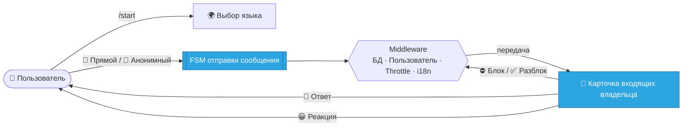

<div align="center">

# 🌉 Telegram Message Bridge

### Современный модульный Telegram-бот, который связывает вашу аудиторию с вами — **напрямую** или **анонимно**.

<br/>

[](https://www.python.org/)
[](https://docs.aiogram.dev/)
[](https://www.sqlalchemy.org/)
[](../../LICENSE)


<br/>

**🌍 Читать на других языках**

[English](../README.md) ·
[العربية](README.ar.md) ·
[Español](README.es.md) ·
**Русский** ·
[中文](README.zh.md)

</div>

---

> [!WARNING]
> **🚧 Проект находится в активной разработке и тестировании.**
> Основные сценарии реализованы и работают, но структура, API и UX могут измениться до стабильного релиза `v1.0`. Используйте для экспериментов и обратной связи.

---

## 📖 Содержание

- [✨ Обзор](#-обзор)
- [🎯 Возможности](#-возможности)
- [🌍 Интернационализация](#-интернационализация)
- [🧭 Как это работает](#-как-это-работает)
- [🧱 Стек технологий](#-стек-технологий)
- [🗂️ Структура проекта](#️-структура-проекта)
- [🚀 Начало работы](#-начало-работы)
- [⚙️ Конфигурация](#️-конфигурация)
- [🧠 Заметки о дизайне](#-заметки-о-дизайне)
- [🗺️ Дорожная карта](#️-дорожная-карта)
- [🤝 Участие](#-участие)
- [📄 Лицензия](#-лицензия)

---

## ✨ Обзор

**Telegram Message Bridge** — это персональный коммуникационный шлюз. Он позволяет любому связаться с владельцем бота через понятный и управляемый сценарий, давая владельцу полный контроль над диалогом.

Пользователи выбирают один из двух режимов:

| Режим | Личность отправителя | Сценарий |
| :--- | :--- | :--- |
| 💌 **Прямой** | Видна владельцу (имя, username, ID) | Друзья, контакты, ответственные сообщения |
| 🥷 **Анонимный** | Полностью скрыта от владельца | Честная обратная связь, личные вопросы |

Владелец получает каждое сообщение в виде насыщенной **карточки входящих** с действиями в одно касание: ответить, заблокировать/разблокировать и поставить эмодзи-реакцию.

---

## 🎯 Возможности

- 📨 **Передача сообщений пользователь → владелец** для текста **и всех типов медиа** (фото, видео, голос, документы…)
- 🎭 **Два режима отправки** — прямой и анонимный — на основе FSM
- 🗃️ **Действия во входящих владельца** — ответ, блокировка/разблокировка, эмодзи-реакции
- 🛡️ **Глобальная блокировка** — заблокированные пользователи отсекаются на уровне middleware
- 🚦 **Анти-спам** — ограничение частоты на основе TTL с временной блокировкой
- 🌍 **Полная i18n** — 21 язык через Fluent, с **сохранением языка пользователя в БД**
- 🟢 **Встроенный выбор языка** — активный язык выделяется зелёной кнопкой
- 🔗 **Социальные ссылки из конфигурации** — управление через валидируемый JSON
- 🧾 **Структурированное логирование** — чистые, профессиональные логи
- ⚡ **Полностью асинхронный** — `aiogram 3` + асинхронный SQLAlchemy + aiosqlite

---

## 🌍 Интернационализация

Бот поставляется с **21 полностью переведённой локалью**:

<div align="center">

🇬🇧 English · 🇷🇺 Русский · 🇺🇦 Українська · 🇪🇸 Español · 🇺🇿 Oʻzbek · 🇧🇷 Português · 🇩🇪 Deutsch
🇮🇹 Italiano · 🇫🇷 Français · 🇹🇷 Türkçe · 🇮🇱 עברית · 🇸🇦 العربية · 🇮🇷 فارسی · 🇨🇳 中文
🇮🇩 Bahasa Indonesia · 🇸🇪 Svenska · 🇲🇾 Bahasa Melayu · 🇳🇱 Nederlands · 🇮🇳 हिन्दी · 🇰🇷 한국어 · 🇻🇳 Tiếng Việt

</div>

Язык определяется автоматически (из Telegram), переключается через встроенное меню и хранится для каждого пользователя в `members.preferred_lang`. Языки с письмом справа налево (персидский, арабский, иврит) полностью поддерживаются.

---

## 🧭 Как это работает



1. Пользователь открывает бота и (по желанию) выбирает язык.
2. Выбирает режим **Прямой** или **Анонимный** и отправляет одно сообщение любого типа.
3. Middleware подготавливают пользователя, применяют блокировки и ограничивают спам.
4. Владелец получает **карточку входящих** и может ответить, заблокировать/разблокировать или поставить реакцию.
5. Ответы доставляются пользователю **на его языке**.

---

## 🧱 Стек технологий

| Слой | Технология |
| :--- | :--- |
| **Фреймворк бота** | [`aiogram 3.25`](https://docs.aiogram.dev/) |
| **Интернационализация** | [`aiogram-i18n`](https://github.com/aiogram/i18n) + Fluent Runtime |
| **БД / ORM** | [SQLAlchemy 2.x](https://www.sqlalchemy.org/) (async) + `aiosqlite` |
| **Конфигурация** | [Pydantic Settings](https://docs.pydantic.dev/latest/concepts/pydantic_settings/) |
| **Логирование** | [`structlog`](https://www.structlog.org/) + [`rich`](https://github.com/Textualize/rich) |
| **Кэш / throttling** | [`cachebox`](https://github.com/awolverp/cachebox) (TTL-кэш) |
| **Управление зависимостями** | [Poetry](https://python-poetry.org/) |

---

## 🗂️ Структура проекта

```text
telegram-msg-bridge/
├── config/                 # Настройки Pydantic + загрузчик соц. ссылок
├── core/                   # Фабрики Bot/Dispatcher, настройка и запуск polling
├── database/               # Коннектор, scope UoW, ORM-модели, хранилища
├── enums/                  # Локали, действия, эффекты, режимы, реакции
├── filter/                 # Кастомные фильтры aiogram (напр. доступ sudo)
├── handler/
│   ├── user/               # command · button · state · callback · helper
│   └── sudo/               # command · state · callback · helper
├── keyboard/
│   ├── user/               # inline/reply-клавиатуры + фабрики callback
│   └── sudo/               # клавиатуры владельца + фабрики callback
├── lexicon/                # Пакеты переводов Fluent (21 язык)
├── middleware/             # scope БД · подготовка пользователя · i18n · throttling
├── state/                  # Группы состояний FSM (пользователь / sudo)
├── util/                   # Настройка логирования + регистрация команд
├── .env.example
├── main.py                 # Точка входа приложения
└── pyproject.toml          # Проект и зависимости Poetry
```

---

## 🚀 Начало работы

### Требования

- **Python** `>=3.12,<3.15`
- **[Poetry](https://python-poetry.org/)** для управления зависимостями
- **Токен Telegram-бота** от [@BotFather](https://t.me/botfather)
- Ваш **Telegram user ID** от [@userinfobot](https://t.me/userinfobot)

### Установка

```bash
# 1. Клонируйте репозиторий
git clone https://github.com/Melfex/telegram-msg-bridge.git
cd telegram-msg-bridge

# 2. Установите зависимости
poetry install

# 3. Настройте окружение и соц. ссылки (см. ниже)
cp .env.example .env
cp config/social_links.example.json config/social_links.json

# 4. Запустите бота
poetry run python main.py
```

При запуске приложение инициализирует логирование, создаёт таблицы БД, регистрирует команды бота и запускает long-polling.

---

## ⚙️ Конфигурация

### Переменные окружения (`.env`)

| Переменная | Обязательна | Описание |
| :--- | :---: | :--- |
| `BOT_TOKEN` | ✅ | Токен бота от [@BotFather](https://t.me/botfather) |
| `SUDO_ID` | ✅ | Telegram ID владельца (sudo) |
| `DATABASE_URL` | ✅ | Async URL БД (по умолчанию: `sqlite+aiosqlite:///database.db`) |

```env
BOT_TOKEN=123456:ABC-DEF...
SUDO_ID=987654321
DATABASE_URL=sqlite+aiosqlite:///database.db
```

### Социальные ссылки (`config/social_links.json`)

```json
{
  "links": [
    { "label": "GitHub",    "url": "https://github.com/your-handle" },
    { "label": "Instagram", "url": "https://instagram.com/your-handle" }
  ]
}
```

> [!NOTE]
> Файл `config/social_links.json` намеренно добавлен в `.gitignore` — скопируйте его из `config/social_links.example.json` и впишите свои ссылки.

---

## 🧠 Заметки о дизайне

- **Маршрутизация действий владельца без состояния** — ответ/блок/реакция несут контекст в компактных callback-данных вместо строк БД для каждого сообщения, что сохраняет БД лёгкой.
- **Доставка с учётом языка** — ответы владельца рендерятся на языке *получателя*, а не владельца.
- **Приватность по дизайну** — анонимные сообщения никогда не сохраняют личность отправителя.
- **Единый коннектор БД** — внедряется один раз и используется всеми middleware.

---

## 🗺️ Дорожная карта

- [x] Прямой и анонимный сценарии сообщений
- [x] Действия во входящих владельца (ответ / блок / реакция)
- [x] i18n на 21 язык + встроенный выбор языка
- [x] Социальные ссылки из конфигурации
- [ ] Расширенное покрытие автотестами
- [ ] Руководства по развёртыванию (Docker / systemd)
- [ ] Опциональный профиль PostgreSQL для продакшена
- [ ] CI-пайплайн и контроль качества

---

## 🤝 Участие

Вклад очень приветствуется! 💛

1. Сделайте **Fork** репозитория
2. Создайте ветку фичи — `git checkout -b feat/amazing-feature`
3. Сделайте **commit** изменений — `git commit -m "feat: add amazing feature"`
4. Сделайте **push** ветки — `git push origin feat/amazing-feature`
5. Откройте **Pull Request**

Для значительных изменений сначала откройте issue для обсуждения направления.

---

## 📄 Лицензия

Распространяется под **лицензией MIT**. Подробности в [`LICENSE`](../../LICENSE).

---

<div align="center">

Сделано с ❤️ на [aiogram 3](https://docs.aiogram.dev/) и современном асинхронном Python.

**Если проект оказался полезным — поставьте ⭐!**

Поддерживается [@Melfex](https://t.me/Melfex)

</div>
