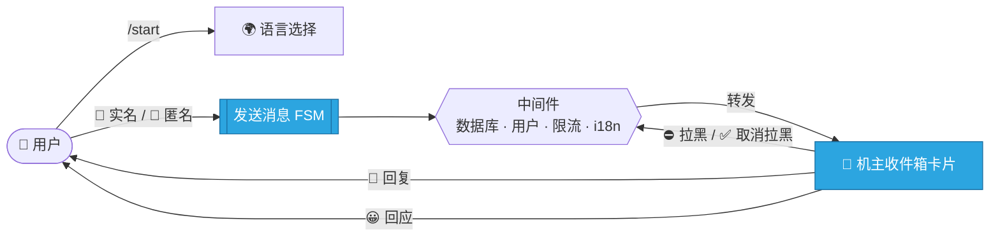

<div align="center">

# 🌉 Telegram 消息桥

### 一个现代化、模块化的 Telegram 机器人，将你的受众与你连接起来 —— **实名**或**匿名**。

<br/>

[](https://www.python.org/)
[](https://docs.aiogram.dev/)
[](https://www.sqlalchemy.org/)
[](../../LICENSE)


<br/>

**🌍 其他语言版本**

[English](../README.md) ·
[العربية](README.ar.md) ·
[Español](README.es.md) ·
[Русский](README.ru.md) ·
**中文**

</div>

---

> [!WARNING]
> **🚧 本项目正在积极开发与测试中。**
> 核心流程已实现且可用，但在稳定版 `v1.0` 发布之前，结构、API 和用户体验可能会发生变化。请用于实验与反馈。

---

## 📖 目录

- [✨ 概述](#-概述)
- [🎯 功能特性](#-功能特性)
- [🌍 国际化](#-国际化)
- [🧭 工作原理](#-工作原理)
- [🧱 技术栈](#-技术栈)
- [🗂️ 项目结构](#️-项目结构)
- [🚀 快速开始](#-快速开始)
- [⚙️ 配置](#️-配置)
- [🧠 设计要点](#-设计要点)
- [🗺️ 路线图](#️-路线图)
- [🤝 贡献](#-贡献)
- [📄 许可证](#-许可证)

---

## ✨ 概述

**Telegram 消息桥**是一个个人通信网关。它让任何人都能通过简洁、引导式的流程联系机器人机主，同时让机主完全掌控对话。

用户可以在两种模式之间选择：

| 模式 | 发送者身份 | 适用场景 |
| :--- | :--- | :--- |
| 💌 **实名** | 对机主可见（姓名、用户名、ID） | 朋友、联系人、需负责的消息 |
| 🥷 **匿名** | 对机主完全隐藏 | 真实反馈、私密提问 |

机主会以丰富的**收件箱卡片**形式收到每条消息，并可一键操作：回复、拉黑/取消拉黑以及表情回应。

---

## 🎯 功能特性

- 📨 **用户 → 机主转发**，支持文本**及所有媒体类型**（图片、视频、语音、文件……）
- 🎭 **两种发送模式** —— 实名与匿名 —— 由 FSM 状态机驱动
- 🗃️ **机主收件箱操作** —— 回复、拉黑/取消拉黑、表情回应
- 🛡️ **全局拉黑生效** —— 被拉黑用户在中间件层被拦截
- 🚦 **反垃圾限流** —— 基于 TTL 的频率限制与临时封禁
- 🌍 **完整国际化** —— 通过 Fluent 支持 21 种语言，并将用户语言**持久化到数据库**
- 🟢 **内联语言选择器** —— 当前语言以绿色按钮高亮
- 🔗 **配置驱动的社交链接** —— 通过经校验的 JSON 文件管理
- 🧾 **结构化日志** —— 干净、专业的日志
- ⚡ **完全异步** —— `aiogram 3` + 异步 SQLAlchemy + aiosqlite

---

## 🌍 国际化

机器人内置 **21 种完整翻译的语言**：

<div align="center">

🇬🇧 English · 🇷🇺 Русский · 🇺🇦 Українська · 🇪🇸 Español · 🇺🇿 Oʻzbek · 🇧🇷 Português · 🇩🇪 Deutsch
🇮🇹 Italiano · 🇫🇷 Français · 🇹🇷 Türkçe · 🇮🇱 עברית · 🇸🇦 العربية · 🇮🇷 فارسی · 🇨🇳 中文
🇮🇩 Bahasa Indonesia · 🇸🇪 Svenska · 🇲🇾 Bahasa Melayu · 🇳🇱 Nederlands · 🇮🇳 हिन्दी · 🇰🇷 한국어 · 🇻🇳 Tiếng Việt

</div>

语言会自动识别（来自 Telegram），可通过内联菜单切换，并按用户存储在 `members.preferred_lang` 中。从右到左（RTL）的语言（波斯语、阿拉伯语、希伯来语）均完全支持。

---

## 🧭 工作原理



1. 用户打开机器人并（可选）选择语言。
2. 选择**实名**或**匿名**模式，发送任意类型的单条消息。
3. 中间件准备用户信息、执行拉黑并限制垃圾消息。
4. 机主收到**收件箱卡片**，可回复、拉黑/取消拉黑或回应。
5. 回复将**以用户自己的语言**送达用户。

---

## 🧱 技术栈

| 层 | 技术 |
| :--- | :--- |
| **机器人框架** | [`aiogram 3.25`](https://docs.aiogram.dev/) |
| **国际化** | [`aiogram-i18n`](https://github.com/aiogram/i18n) + Fluent Runtime |
| **数据库 / ORM** | [SQLAlchemy 2.x](https://www.sqlalchemy.org/)（异步）+ `aiosqlite` |
| **配置** | [Pydantic Settings](https://docs.pydantic.dev/latest/concepts/pydantic_settings/) |
| **日志** | [`structlog`](https://www.structlog.org/) + [`rich`](https://github.com/Textualize/rich) |
| **缓存 / 限流** | [`cachebox`](https://github.com/awolverp/cachebox)（TTL 缓存） |
| **依赖管理** | [Poetry](https://python-poetry.org/) |

---

## 🗂️ 项目结构

```text
telegram-msg-bridge/
├── config/                 # Pydantic 配置 + 社交链接加载器
├── core/                   # Bot/Dispatcher 工厂、初始化与 polling 运行器
├── database/               # 连接器、UoW 作用域、ORM 模型、存储
├── enums/                  # 语言、动作、效果、模式、表情
├── filter/                 # 自定义 aiogram 过滤器（如 sudo 权限）
├── handler/
│   ├── user/               # command · button · state · callback · helper
│   └── sudo/               # command · state · callback · helper
├── keyboard/
│   ├── user/               # 用户内联/回复键盘 + 回调工厂
│   └── sudo/               # 机主键盘 + 回调工厂
├── lexicon/                # Fluent 翻译包（21 种语言）
├── middleware/             # 数据库作用域 · 用户注入 · i18n · 限流
├── state/                  # FSM 状态组（用户 / sudo）
├── util/                   # 日志设置 + 机器人命令注册
├── .env.example
├── main.py                 # 应用入口
└── pyproject.toml          # Poetry 项目与依赖
```

---

## 🚀 快速开始

### 前置要求

- **Python** `>=3.12,<3.15`
- **[Poetry](https://python-poetry.org/)** 用于依赖管理
- 来自 [@BotFather](https://t.me/botfather) 的 **Telegram Bot Token**
- 来自 [@userinfobot](https://t.me/userinfobot) 的你的 **Telegram 用户 ID**

### 安装

```bash
# 1. 克隆仓库
git clone https://github.com/Melfex/telegram-msg-bridge.git
cd telegram-msg-bridge

# 2. 安装依赖
poetry install

# 3. 配置环境与社交链接（见下文）
cp .env.example .env
cp config/social_links.example.json config/social_links.json

# 4. 运行机器人
poetry run python main.py
```

启动时，应用会初始化日志、创建数据库表、注册机器人命令并启动 long-polling。

---

## ⚙️ 配置

### 环境变量（`.env`）

| 变量 | 必填 | 说明 |
| :--- | :---: | :--- |
| `BOT_TOKEN` | ✅ | 来自 [@BotFather](https://t.me/botfather) 的机器人令牌 |
| `SUDO_ID` | ✅ | 机主（sudo）的 Telegram 用户 ID |
| `DATABASE_URL` | ✅ | 异步数据库 URL（默认：`sqlite+aiosqlite:///database.db`） |

```env
BOT_TOKEN=123456:ABC-DEF...
SUDO_ID=987654321
DATABASE_URL=sqlite+aiosqlite:///database.db
```

### 社交链接（`config/social_links.json`）

```json
{
  "links": [
    { "label": "GitHub",    "url": "https://github.com/your-handle" },
    { "label": "Instagram", "url": "https://instagram.com/your-handle" }
  ]
}
```

> [!NOTE]
> `config/social_links.json` 已被有意加入 `.gitignore` —— 请从 `config/social_links.example.json` 复制并填入你自己的链接。

---

## 🧠 设计要点

- **机主操作的无状态路由** —— 回复/拉黑/回应将上下文携带在紧凑的回调数据中，而非为每条消息建立数据库行，从而保持数据库轻量。
- **按语言投递** —— 机主的回复以*接收者*的语言渲染，而非机主的语言。
- **隐私优先设计** —— 匿名消息绝不保存发送者身份。
- **单一数据库连接器** —— 仅注入一次并在所有中间件间共享。

---

## 🗺️ 路线图

- [x] 实名与匿名消息流程
- [x] 机主收件箱操作（回复 / 拉黑 / 回应）
- [x] 21 种语言的 i18n + 内联语言选择器
- [x] 配置驱动的社交链接
- [ ] 扩展自动化测试覆盖
- [ ] 部署指南（Docker / systemd）
- [ ] 可选的 PostgreSQL 生产配置
- [ ] CI 流水线与质量门禁

---

## 🤝 贡献

非常欢迎贡献！💛

1. **Fork** 本仓库
2. 创建特性分支 —— `git checkout -b feat/amazing-feature`
3. **提交**更改 —— `git commit -m "feat: add amazing feature"`
4. **推送**分支 —— `git push origin feat/amazing-feature`
5. 发起 **Pull Request**

对于较大的更改，请先开 issue 讨论方向。

---

## 📄 许可证

基于 **MIT 许可证**发布。详见 [`LICENSE`](../../LICENSE)。

---

<div align="center">

使用 [aiogram 3](https://docs.aiogram.dev/) 和现代异步 Python 用 ❤️ 打造。

**如果这个项目对你有帮助，欢迎点一个 ⭐！**

由 [@Melfex](https://t.me/Melfex) 维护

</div>
